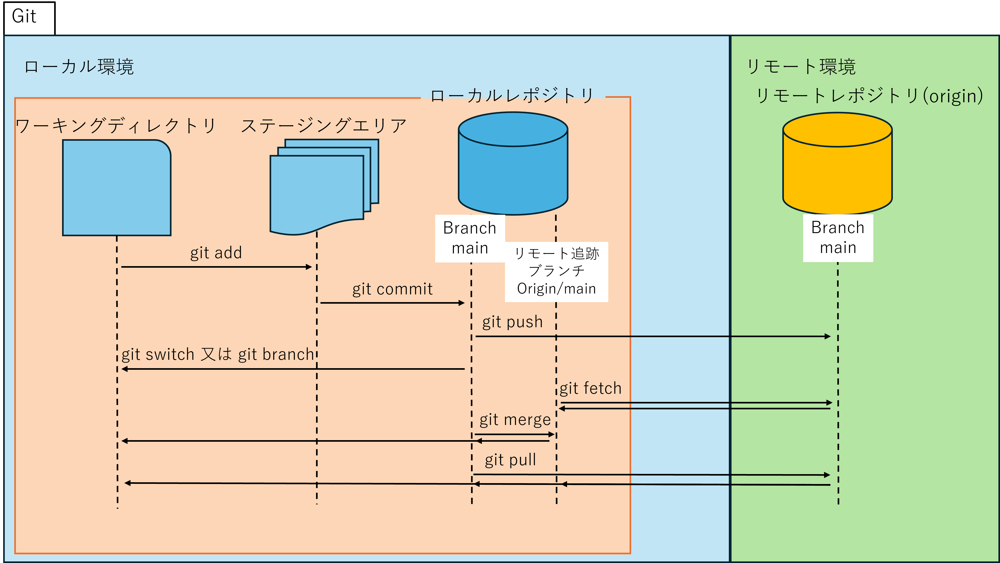

# Document-on-the-integration-of-VisualStudio2022-and-GitHub
For NewGraduateTraining - Explanation of how to manage source code using Git and GitHub in VisualStudio 2022  

> [!TIP]
> 今後コンソールでlog等を確認する際に日本語が文字化けして何が何だか分からなくならないようにメモ  
> Windows 設定->時刻と言語->言語と地域->管理用の言語設定->システムロケールの変更->ベータ: ワールドワイド言語サポートで Unicode UTF-8を使用にチェック。  
> PCの再起動


↓のコマンドはMonorepo/単一レポジトリ想定

<details>

<summary>よく使用するGitコマンド一覧(研修用)</summary>　　

``` 
git help
``` 
　コマンド一覧を表示　　
<br>


```
git コマンド名 --help
``` 
　そのコマンドの使用方法、オプションを詳しくみられる(WEBに遷移する)
 <br>


``` 
git status
``` 
　今編集追加しているファイルを表示　　
<br>


 ``` 
git add ファイル名
``` 
　指定したファイルをステージング　　
<br>

 
 ```
git add -A
``` 
　新規追加、更新、削除のファイルをステージング　　
<br>


 ``` 
git add -u
``` 
　更新、削除のファイルのステージング　　
<br>


``` 
git commit -m "コミットメッセージ入力"
``` 
　コミットする際のコマンド　　
<br>


``` 
git log
``` 
　commit履歴の表示（履歴を見終わったらqで戻れる）　　
<br>


```
git fetch origin
```
　リモートレポジトリの全てのブランチの最新のコミット履歴を取得、リモート追跡ブランチに反映　　
<br>


```
git fetch origin ブランチ名
``` 
　リモートレポジトリの指定したブランチのみの最新のコミット履歴を取得、リモート追跡ブランチに反映　　
<br>


```
git merge ブランチ名
``` 
　指定したブランチを現在いるブランチに取り込む  
<br>


```
git merge origin/ブランチ名
``` 
　リモート追跡ブランチの指定したブランチを現在いるブランチに取り込む 　　
 <br>


```
git pull origin
```
　現在いるブランチに関連したリモートレポジトリブランチの最新のコミット履歴を取得、リモート追跡ブランチに反映、現在いるブランチに取り込む　　
<br>


```
git push origin
``` 
　リモートレポジトリにプッシュ 　　
<br>


```
git branch
```
　ブランチの一覧表示(ブランチ名の前に＊が付いているものが現在いるブランチ)　　
<br>


```
git branch -a
```
　リモート追跡ブランチとローカルブランチの両方を一覧表示　　
<br>


```
git branch -r
``` 
　リモート追跡ブランチを表示
 <br>


```
git branch ブランチ名
```
　新しいブランチの作成
 <br>


> [!WARNING]  
>switchコマンドは実験的なもので、Versionによって動作が変わる可能性があります。  
>その為従来のcheckoutコマンドも載せておきます。
```
git switch ブランチ名
```
```
git checkouto ブランチ名
```
　ブランチの切り替え  
　※ブランチの切り替えを行う前にキチンとコミットしましょう。  
<br>


```
git switch -c ブランチ名
```
```
git checkouto -b ブランチ名
```
　ブランチを作成して作業ブランチを切り替え  
　※「-c」を大文字のCつまり「-C」に変えてしまうと同名のブランチが存在した場合でも強制的に作成されるため注意してください。  
<br>


大まかなgitの造りとgitコマンドの図



 </details>

### ~~GitHubにレポジトリが生成できたことを確認できた人はTeamsの個人チャットで報告してくれると嬉しいな。~~
